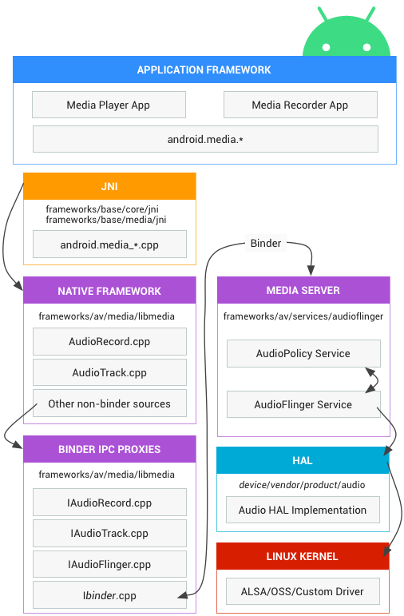

# 오디오 프레임워크

안드로이드 표준 OS 기준

## 오디오 프레임워크 구조

1. **Application Framework**
    - 앱에서 사용하는 **고수준 오디오 API**(예: `MediaPlayer`, `MediaRecorder`)를 제공해, 개발자가 쉽게 오디오 재생/녹음 기능을 구현하도록 도와줌.
    - 실제로 앱 개발을 하면서, Java/Kotlin으로 작성된 앱 코드에서 직접 접근하는 레이어
    - 고수준 API: 'MediaPlayer', 'MediaRecorder' 등/ 파일 재생, 녹음 등 간단한 오디오 처리에 사용
    - 저수준 API: 'AudioTrack', 'AudioRecord' 등/ 실시간 처리가 필요한 경우 많이 씀

2. **JNI (Java Native Interface)**
    - Java 계층에서 C/C++(Native) 계층의 코드나 라이브러리를 호출하기 위한 **브리지** 역할.
    - `android.media` 패키지의 일부 메서드들은 내부적으로 JNI를 통해 Native 라이브러리와 통신함.
    - Java와 C/C++ 코드 간의 상호작용을 위한 인터페이스

3. **Native Framework** (libmedia 등)
    - C/C++ 레벨에서 오디오 처리를 담당하는 라이브러리들(`AudioTrack.cpp`, `AudioRecord.cpp`, `AudioFlinger`, `AudioPolicy` 등)이 위치.
    - Binder IPC를 통해 **MediaServer**(실제 프로세스)와 통신하며, 오디오 스트림을 제어하거나 전달함.
    - AAudio, OpenSL ES 같은 네이티브 수준의 API도 안드로이드가 제공하는 API임.
      - C/C++ 레벨에서 저수준 제어가 필요하거나 고성능/저지연 처리가 필요할 때 고려하면 됨.
      - 하지만 최종적으로는 MediaServer(또는 AudioFlinger) → HAL → 커널을 거쳐 하드웨어에 접근함.  
      (즉, AAudio/OpenSL ES가 있다고 해서 MediaServer를 우회해서 직접 HAL이나 커널로 접근하는 건 아님.)

4. **MediaServer**
    - 네이티브 데몬
    - 안드로이드에서 오디오/비디오와 관련된 **미디어 서비스를 통합 관리**하는 프로세스.
    - 내부에 **AudioFlinger**(믹싱/라우팅)와 **AudioPolicyService**(오디오 정책 관리) 등이 구동됨.
   - **AudioPolicyService**:
     - 오디오의 우선순위, 볼륨 정책, 라우팅 규칙 등을 결정
     - 어떤 앱이 현재 오디오를 사용 중인지, 전화 통화나 알람, 음악 재생 등이 겹칠 때 어떤 우선순위를 줄 것인지 등을 결정
     - AudioManger의 AudioFocus, AudioAttributes 등으로 정책 결정 가능(Application 레벨)
   - **AudioFlinger**:
       - AudioPolicy에서 결정된 규칙에 따라 오디오를 실제 믹싱/전달하는 작업을 수행
       - 재생(Playback): 앱 → AudioFlinger → (Policy 확인) → HAL → 스피커/헤드폰
       - 녹음(Record): 마이크/HAL → AudioFlinger → (Policy 확인) → 앱(AudioRecord 등)

5. **HAL (Hardware Abstraction Layer)**
    - 디바이스별 오디오 하드웨어에 맞춰 구현되는 **추상화 레이어**.
    - AudioFlinger(또는 다른 상위 레이어)에서 HAL을 호출하면, 실제 드라이버/하드웨어에 접근해 입출력을 수행함.

6. **Linux Kernel**
    - **ALSA**(Advanced Linux Sound Architecture)나 **OSS** 같은 오디오 드라이버를 통해 실제 사운드 카드(코덱)나 마이크, 스피커 등에 신호를 주고받음.
    - 안드로이드도 결국 리눅스 커널을 기반으로 하므로, 최종적으로는 이 커널 레벨 드라이버가 오디오 하드웨어를 제어함.

---    

## 참고 자료
https://source.android.com/docs/core/audio?hl=ko