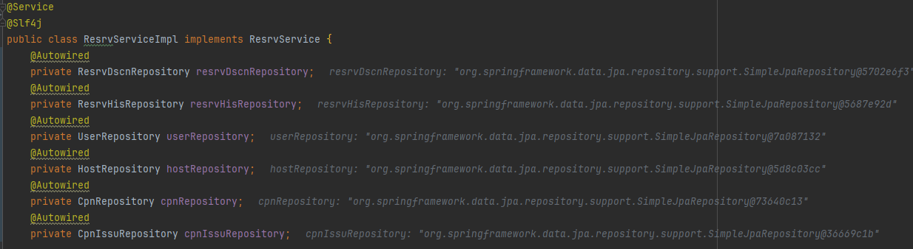

## 🙋‍♀️ 테스트코드 오류

- [에러문구] 테스트 코드 작성시, 실행단 비즈니스 로직에서 의존성 주입받은 객체가 nullpointer Exception

```
java.lang.NullPointerException
	at com.example.springboot.service.resrv.ResrvServiceImpl.saveRequest(ResrvServiceImpl.java:42)
	at com.example.springboot.service.resrv.ResrvServiceImpl$$FastClassBySpringCGLIB$$ef7950d2.invoke(<generated>)
	at org.springframework.cglib.proxy.MethodProxy.invoke(MethodProxy.java:218)
```

- [원인]

  - 의존성 주입을 @RequiredArgsConstructor 를 사용해서 해왔는데, 테스트코드에선 제대로 작동하지 않았음

- [해결방안]
  - @Autowired 형태의 필드 주입으로 변경하여 해결하였음
    

<br>

## ❓여전히 풀리지 않는 질문들

- 의존성 주입의 방법 차이와 원리 왜?
  <br>
  <br>

## 참고 문서

- https://wooj-coding-fordeveloper.tistory.com/79
  - 같은 에러지만 나는 어노테이션 추가함
