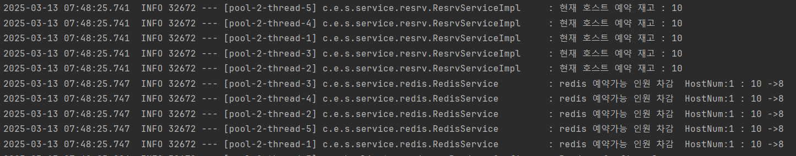

### Could not resolve placeholder 'spring.redis.host' in value "${spring.redis.host}"

- application.properties 에 변수설정 읽는데 문제가 있는 듯
- redis 설정 host/post의 순서를 변경해야함

```
    @Value("${spring.redis.host:localhost}")
    private String host;

    @Value("${spring.redis.port:6379}")
    private String port;
```

- 이런식으로 디폴트 값을 설정해주어서 해결은 했으나, 무엇이 원인인지는 모르곘음

### java.lang.IllegalMonitorStateException: attempt to unlock lock, not locked by current thread by node id: b5d23d89-809d-4e26-b060-03dfb6e03459 thread-id: 90

- 테스트 과정에서 스레드 할당에서 오류가 남
- https://kirinman.tistory.com/97

### 테스트 Redisson Lock 획득 실패 : null

- redis 서버에서 key로 값을 찾을 때 값이 없어서 여기서부터 에러가 남
- https://velog.io/@greentea/spring-RedisTemplate.hasKey%EA%B0%92%EC%9D%B4-null%EC%9D%B4-%EB%82%98%EC%98%AC-%EA%B2%BD%EC%9A%B0 `key가 존재하지 않는다.`
- haskey로 변경함

### 스레드가 동시성 반영 못하고 있음


