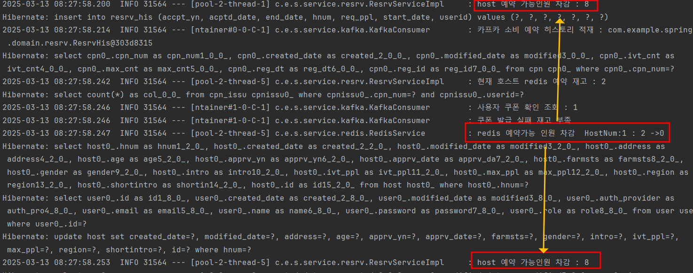

### 🥑 Could not resolve placeholder 'spring.redis.host' in value "${spring.redis.host}"

- application.properties 에 변수설정 읽는데 문제가 있는 듯
- redis 설정 host/post의 순서를 변경해야함

```
    @Value("${spring.redis.host:localhost}")
    private String host;

    @Value("${spring.redis.port:6379}")
    private String port;
```

- 이런식으로 디폴트 값을 설정해주어서 해결은 했으나, 무엇이 원인인지는 모르곘음

### 🥑 java.lang.IllegalMonitorStateException: attempt to unlock lock, not locked by current thread by node id: b5d23d89-809d-4e26-b060-03dfb6e03459 thread-id: 90

- 테스트 과정에서 스레드 할당에서 오류가 남
- https://kirinman.tistory.com/97

### 🥑 테스트 Redisson Lock 획득 실패 : null

- redis 서버에서 key로 값을 찾을 때 값이 없어서 여기서부터 에러가 남
- https://velog.io/@greentea/spring-RedisTemplate.hasKey%EA%B0%92%EC%9D%B4-null%EC%9D%B4-%EB%82%98%EC%98%AC-%EA%B2%BD%EC%9A%B0 `key가 존재하지 않는다.`
- haskey로 변경함

### 🥑 스레드가 동시성 반영 못하고 있음


- 임계영역에 대해 락 제대로 획득이 안되고 있는것 같음
- boolean isLocked = lock.tryLock(3, 3, TimeUnit.SECONDS);

### 🥑 호스트 메인 테이블의 DB 재고 업데이트가 바로 바로 안됨

```
// 4) redis 재고 차감 write through
redisService.deductAvailPpl(hnum, curReqPpl);
// 호스트 재고 차감
host.get().updateIvtPpl(histRequestDto.getReqPpl());
hostRepository.save(host.get());
```

- redis 업데이트 하고 바로 db 업데이트인데 왜 업데이트 바로 안됨?
  
- redis는 제대로 업데이트 되고 있는데 안되고 있음
- Entity update 메서드에 재고 값을 처음 host entity 생성될 떄의 그 값으로 주고 있었기 때문에, 최초 값에서 매번 -차감

```
public void updateIvtPpl(int curIvtPplByHost, int reqPpl) {
    this.ivtPpl = curIvtPplByHost - reqPpl;
}
```

- 현재 조회된 차감된 재고의 값과 함께 차감할 값도 넘겨줌

### 🥑 단위 테스트 코드 작성

- https://velog.io/@u-nij/JUnit5-%EB%8B%A8%EC%9C%84-%ED%85%8C%EC%8A%A4%ED%8A%B8Extendwith
- https://mangkyu.tistory.com/143
- 의존성 때문에 테스트가 어렵기 때문에, 가짜 객체를 추가하여 가짜 객체에 원하는 결과를 `stub` 함
- @InjectMocks 를 테스트 하는 단위의 클래스로 만들어주고 이후에 가짜 객체들을 @Mock 으로 선언해서 사용함
- stub : 이럴 떈 이 값을 반환해라고 정함
