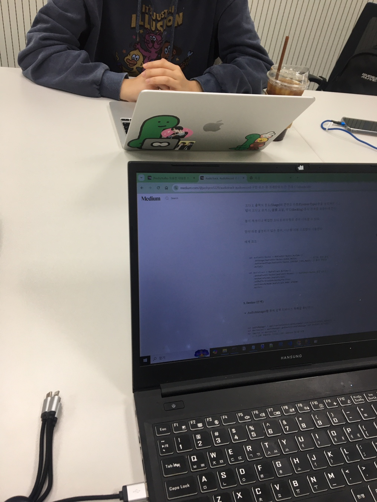
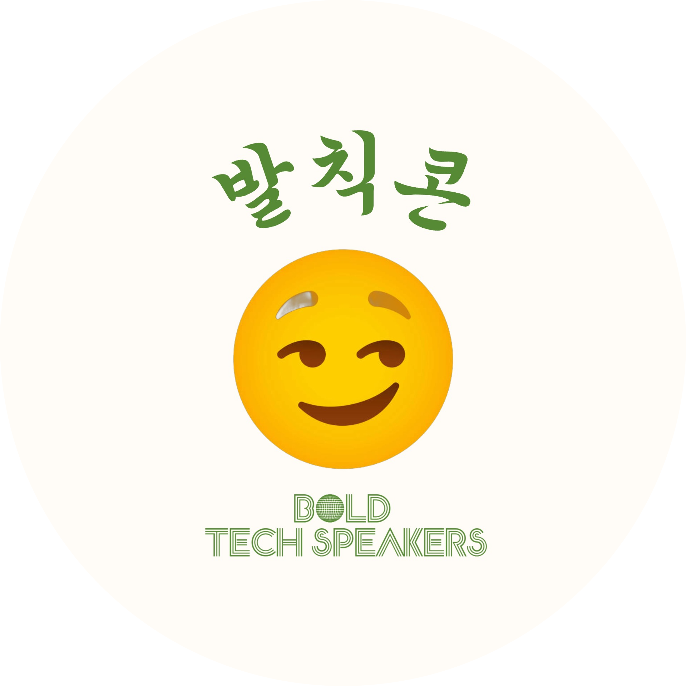
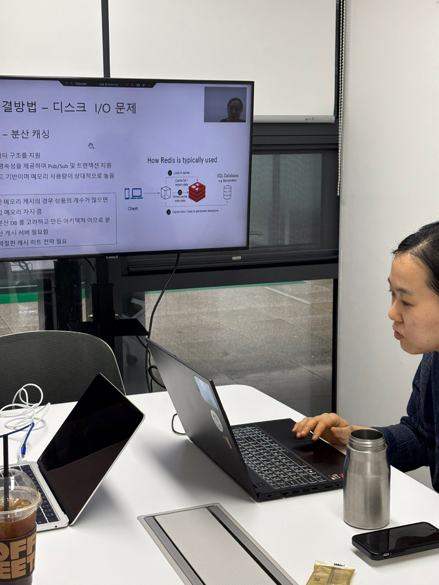
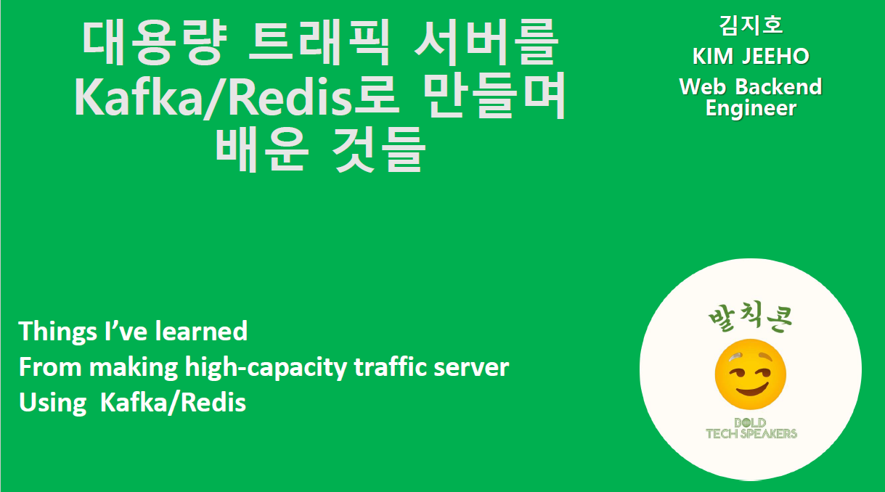
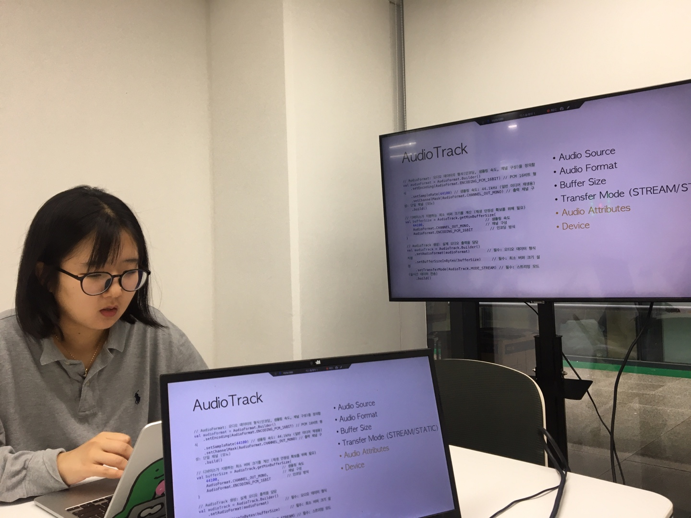
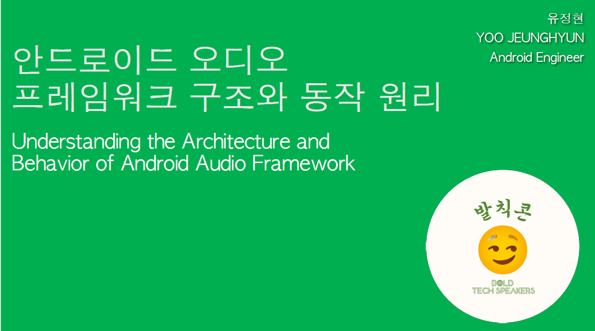

# 😏 발칙한 Tech Speakers

### 1. 🌱 스터디 개요 Intro

**“메이저에 진입하기 힘들다면, 내가 판을 만들면 되는거지!”**

> 다른 세상의 이야기인 것만 같은 메이저 회사의 화려한 기술들 _(우리 회사… IT회사는 맞는걸까..?ㅎ)_
>
> 진입장벽으로 이미 아득해져버린 내로라하는 기술 세미나 _(어쩌면 내 적성 이쪽이 아닌걸수도..?ㅎ)_
>
> …… 에 참여할 수 없다면
>
> 😏 내가 한번 만들어보지 뭐!

<br>

### 2. 🌲 스터디 최종 목표 Mission

- 목표한 주제에 대한 깊은 탐구
  - 누군가에게 설명(=프리젠테이션) 을 해줄 수 있을 정도로
- 공부에 대한 기록 남기기
  - 정리한 자료는 깃에 계속해서 업로드 하기
  - 서사가 있는 아티클 3개

<br>

### 3. 🥔 참여자 Contributors

|                                                              Kim Jeeho                                                              |                                                           Yoo JeongHyeon                                                            |                                                            Lee HeeYoung                                                             |
| :---------------------------------------------------------------------------------------------------------------------------------: | :---------------------------------------------------------------------------------------------------------------------------------: | :---------------------------------------------------------------------------------------------------------------------------------: |
|  |  |  |
|                                           [Tech Blog](https://sweetjhpotato.tistory.com/)                                           |                                       [Tech Blog](https://not-just-at-12-oclock.tistory.com/)                                       |                                                            [Tech Blog]()                                                            |
|                                                 [Git](https://github.com/JEEEEEEHO)                                                 |                                                [Git](https://github.com/akfrdma0125)                                                |                                                               [Git]()                                                               |

<br>

### 4. 📝 스터디 진행 과정

- 진행기간 : 2025.03.01 - 2025.04.12
- 기술에 대한 심도있는 연구와 아티클 작성
- 2주 간격 오프라인 미팅 후 성과 공유  
  <br>

  

<br>

### 5. 🎙️ 최종 산출물



#### 김지호 : "대용량 트래픽 서버를 Kafka/Redis로 만들며 배운 것들"

<div style="display: flex; gap: 10px; align-items: center;">
  
     
     </div>

- 아티클 : https://medium.com/@rlawlgh3245
- 발표 영상 : https://youtu.be/MjZrEpEDZkI

- 소감 :

  ```text
  머리로 이해하는 것과 그것을 설명하는 것과는 지식의 깊이 차이가 상당하다는 것을 깨달았습니다.
  심지어는 알고 있다고 생각했던 개념들도 잘 못 이해한 경우도 많았구요.

  확실히 "직접 구축하며" 시행착오를 겪어야만,
  그리고 그 결과를 "설명" 할 정도로 분석하는 방법이야 말로
  기술을 습득하는 좋은 방법이라는 것을 배울 수 있었습니다.

  무엇보다 적은 인원이지만 마지막까지 최선을 다해준 스터디원 정현님께 감사하고,
  함께 공부하는 즐거움을 다시 한번 느끼고 갑니다. :)
  ```

  <br>

#### 유정현 : "안드로이드 오디오 프레임워크 구조와 동작 원리"

<div style="display: flex; gap: 10px; align-items: center;">
  
  
</div>
   
- 아티클 : https://medium.com/@jeohyoo1229
- 발표영상 : https://youtu.be/zTK5GTGEMg0

- 소감:

  ```text
  오디오 프레임워크에 대한 이해를 하고자 아티클을 쓰면서,
  글을 하나 쓰기 위해 생각보다 많은 자료를 조사해야 한다는 것을 느꼈습니다.
  스터디를 하기 전에는 코딩을 할 때 이 함수 혹은 변수의 의미에 대해 깊이 생각하기 보다는,
  그냥 쓰라니까 쓴다 라는 생각이었습니다.

  그러나 지금, 그 변수 하나가 어떻게 동작하여
  하드웨어까지 전달되는지 어렴풋이 이해하게 되었습니다.

  물론 스터디가 끝난 지금도 많아야 5% 정도로 여전히 모르는 것이 많습니다 :)
  더 깊이 이해하기 위해서는 오디오 하드웨어에 대한
  용어 및 구조에 대한 공부가 필수라는 것을 느꼈습니다.
  서로 아티클을 발표하고, 질문을 하는 과정에서 모르는 분야를 알게 되고,
  제가 발표하는 내용에서조차, 이 부분은 아직 모르는구나를 깨달을 수 있었습니다.

  2달이라는 짧은 시간이었지만, 많은 것을 배울 수 있었던 시간이었습니다.
  ```
